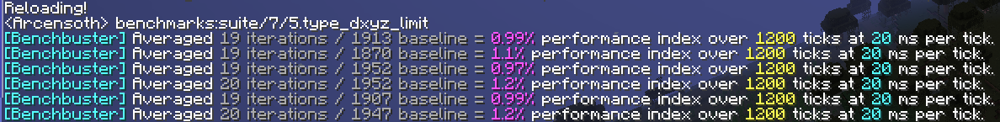
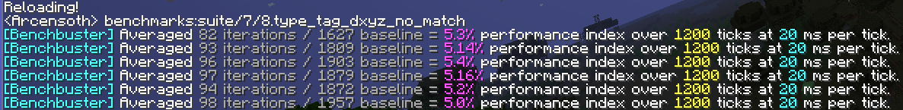
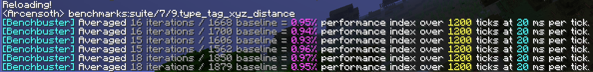
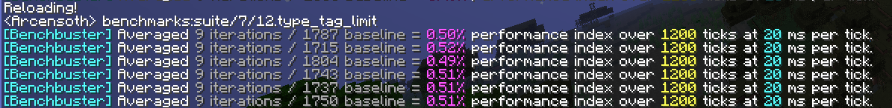

# Suite #7 results for version 1.14 (2019/04/24): Single-player survival world
- Using suite #7 from commit 0a97db41743ee4263dc3c90b34afcf0265428032
- [Setup function](./.setup.mcfunction)
- [Teardown function](./.teardown.mcfunction)
- [Crash report](./crash-2019-04-24_22.45.20-client.txt)
- [Candidates](#candidates)
    - [Candidate 1: Self selector](#candidate-1-self-selector)
    - [Candidate 2: Static UUID](#candidate-2-static-uuid)
    - [Candidate 3: Bounding box](#candidate-3-bounding-box)
    - [Candidate 4: Type and bounding box](#candidate-4-type-and-bounding-box)
    - [Candidate 5: Type and bounding box with limit](#candidate-5-type-and-bounding-box-with-limit)
    - [Candidate 6: Type, tag, and bounding box](#candidate-6-type-tag-and-bounding-box)
    - [Candidate 7: Bounding box without a match](#candidate-7-bounding-box-without-a-match)
    - [Candidate 8: Type, tag, and bounding box without a match](#candidate-8-type-tag-and-bounding-box-without-a-match)
    - [Candidate 9: Type, tag, and bounding sphere](#candidate-9-type-tag-and-bounding-sphere)
    - [Candidate 10: Tag only](#candidate-10-tag-only)
    - [Candidate 11: Type and tag](#candidate-11-type-and-tag)
    - [Candidate 12: Type, tag, and limit](#candidate-12-type-tag-and-limit)

## Candidates
```
benchmarks:suite/7/1.self
benchmarks:suite/7/2.uuid
benchmarks:suite/7/3.dxyz
benchmarks:suite/7/4.type_dxyz
benchmarks:suite/7/5.type_dxyz_limit
benchmarks:suite/7/6.type_tag_dxyz
benchmarks:suite/7/7.dxyz_no_match
benchmarks:suite/7/8.type_tag_dxyz_no_match
benchmarks:suite/7/9.type_tag_xyz_distance
benchmarks:suite/7/10.tag
benchmarks:suite/7/11.type_tag
benchmarks:suite/7/12.type_tag_limit
```

### [Candidate 1: Self selector](./1.self.mcfunction)
```mcfunction
execute as @s run
```


### [Candidate 2: Static UUID](./2.uuid.mcfunction)
```mcfunction
execute as 0-0-0-0-1 run
```


### [Candidate 3: Bounding box](./3.dxyz.mcfunction)
```mcfunction
execute as @e[x=0, y=120, z=0, dx=1, dy=1, dz=1] run
```


### [Candidate 4: Type and bounding box](./4.type_dxyz.mcfunction)
```mcfunction
execute as @e[type=minecraft:armor_stand, x=0, y=120, z=0, dx=1, dy=1, dz=1] run
```


### [Candidate 5: Type and bounding box with limit](./5.type_dxyz_limit.mcfunction)
```mcfunction
execute as @e[type=minecraft:armor_stand, x=0, y=120, z=0, dx=1, dy=1, dz=1, limit=1] run
```


### [Candidate 6: Type, tag, and bounding box](./6.type_tag_dxyz.mcfunction)
```mcfunction
execute as @e[type=minecraft:armor_stand, tag=benchmarks.single, x=0, y=120, z=0, dx=1, dy=1, dz=1] run
```


### [Candidate 7: Bounding box without a match](./7.dxyz_no_match.mcfunction)
```mcfunction
execute as @e[x=0, y=-20, z=0, dx=1, dy=1, dz=1] run
```


### [Candidate 8: Type, tag, and bounding box without a match](./8.type_tag_dxyz_no_match.mcfunction)
```mcfunction
execute as @e[type=minecraft:armor_stand, tag=benchmarks.nothing, x=0, y=120, z=0, dx=1, dy=1, dz=1] run
```


### [Candidate 9: Type, tag, and bounding sphere](./9.type_tag_xyz_distance.mcfunction)
```mcfunction
execute as @e[type=minecraft:armor_stand, tag=benchmarks.single, x=0, y=120, z=0, distance=..1] run
```


### [Candidate 10: Tag only](./10.tag.mcfunction)
```mcfunction
execute as @e[tag=benchmarks.single] run
```


### [Candidate 11: Type and tag](./11.type_tag.mcfunction)
```mcfunction
execute as @e[type=minecraft:armor_stand, tag=benchmarks.single] run
```


### [Candidate 12: Type, tag, and limit](./12.type_tag_limit.mcfunction)
```mcfunction
execute as @e[type=minecraft:armor_stand, tag=benchmarks.single, limit=1] run
```

